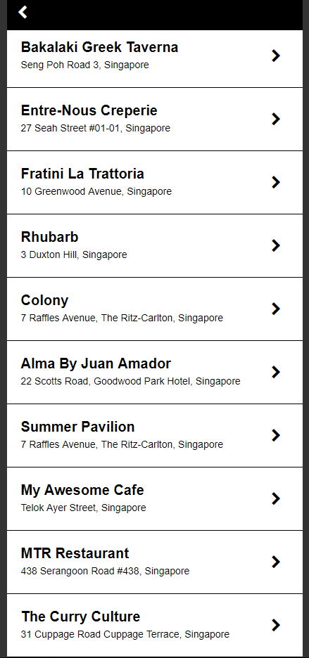

# css-exercise-three
CSS exercise for the Bloc program focused on box model.

Applied the CSS reset to the project, changed the box-sizing property to `border-box`, used nesting to style the text, established the width of the `.restaurant-list` divs via percentages and changed their `background-color` while in a hover state.

